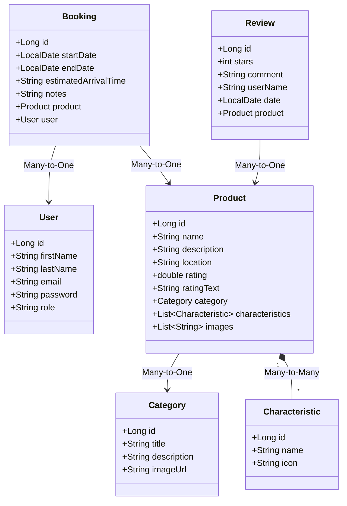

# 🏢 Digital Booking — Plataforma de Reservas de Alojamiento
> *"Sentite como en tu hogar"* 🏠

Digital Booking es una plataforma web full-stack diseñada para conectar a viajeros con su alojamiento ideal (Hoteles, Departamentos, Hostels y Bed & Breakfasts). Los usuarios pueden explorar recomendaciones, buscar por destino y disponibilidad en tiempo real, guardar sus favoritos, leer reseñas, simular contacto por WhatsApp y realizar reservas con confirmación instantánea por correo electrónico. El sistema cuenta con un completo panel de administración para gestionar el catálogo.

---

## 🛠️ Tecnologías y Librerías

El proyecto está construido bajo una arquitectura desacoplada utilizando el siguiente conjunto de tecnologías:

### Frontend
*   **React 18.2** (Librería principal de interfaz de usuario)
*   **Vite 6.x** (Servidor de desarrollo y compilador optimizado)
*   **React Router Dom 6.x** (Manejador de rutas y guards de navegación)
*   **Lucide React** (Paquete premium de iconos vectoriales)
*   **Vanilla CSS** (Hojas de estilo puras y flexibles)

### Backend & Base de Datos
*   **Java 21 JDK** (Lenguaje de desarrollo principal)
*   **Spring Boot 3.4.x / 4.1.0** (Starter Parent)
    *   *Spring Data JPA* (Mapeador objeto-relacional)
    *   *Spring Web* (Desarrollo de API REST)
    *   *Spring Mail* (Starter para envío de correos electrónicos)
*   **H2 Database Engine** (Base de datos SQL en memoria autosebrada en el inicio de la app)
*   **Maven** (Gestor de dependencias y compilación)

---

## 📦 Instalación y Ejecución Local

### Requisitos Previos
*   **Node.js**: v18 o superior instalado.
*   **Java JDK**: versión 17 o superior (desarrollado con Java 21).

### Pasos Generales
1.  **Clonar el repositorio**:
    ```bash
    git clone https://github.com/epontoni/desafio-profesional.git
    cd desafio-profesional
    ```

### Ejecución del Backend (Spring Boot)
1.  Ingresar a la carpeta de la API:
    ```bash
    cd api
    ```
2.  Compilar el backend:
    ```bash
    ./mvnw clean compile
    ```
3.  Iniciar el servidor de Spring Boot:
    ```bash
    ./mvnw spring-boot:run
    ```
4.  La API estará disponible en `http://localhost:8080`.
5.  Puedes acceder a la consola visual de la base de datos H2 en `http://localhost:8080/h2-console` usando:
    *   **JDBC URL**: `jdbc:h2:mem:digitalbookingdb`
    *   **User Name**: `sa`
    *   **Password**: (dejar en blanco)

### Ejecución del Frontend (React + Vite)
1.  Ingresar a la carpeta del frontend:
    ```bash
    cd ../frontend
    ```
2.  Instalar dependencias:
    ```bash
    npm install
    ```
3.  Iniciar servidor de desarrollo:
    ```bash
    npm run dev
    ```
4.  Abrir la aplicación en tu navegador en `http://localhost:5173`.

---

## ⚙️ Variables de Entorno y Configuración

### Backend Configuration (`api/src/main/resources/application.properties`)
```properties
server.port=8080
spring.datasource.url=jdbc:h2:mem:digitalbookingdb
spring.datasource.driverClassName=org.h2.Driver
spring.datasource.username=sa
spring.datasource.password=
spring.jpa.database-platform=org.hibernate.dialect.H2Dialect
spring.h2.console.enabled=true
```

### Frontend Configuration (`frontend/.env.development` / default fallback)
La URL de la API local está configurada por defecto como:
`http://localhost:8080/api`

---

## 🔑 Cuentas de Prueba Autocreadas (Data Seeding)
El sistema precarga automáticamente los siguientes perfiles al iniciar:

*   **Administrador**:
    *   **Email**: `admin@digitalbooking.com`
    *   **Contraseña**: `admin123`
*   **Usuario Común**:
    *   **Email**: `user@digitalbooking.com`
    *   **Contraseña**: `user123`

---

## 🗄️ Diagrama de Base de Datos (Relacional)

El esquema de datos relacional modelado en Spring Boot se representa a continuación:



---

## 🔌 Endpoints de la API REST

| Método | Endpoint | Descripción | Requiere Auth |
| :--- | :--- | :--- | :---: |
| **POST** | `/api/auth/register` | Registrar un nuevo usuario en el sistema. Dispara el correo de bienvenida. | ❌ No |
| **POST** | `/api/auth/login` | Iniciar sesión. Retorna DTO con datos de perfil y rol. | ❌ No |
| **GET** | `/api/products` | Obtener listado de alojamientos (permite filtrar opcionalmente por `categoryTitle`). | ❌ No |
| **GET** | `/api/products/random` | Obtener 10 alojamientos barajados al azar para la sección de recomendaciones. | ❌ No |
| **GET** | `/api/products/page` | Obtener catálogo de productos paginado. | ❌ No |
| **GET** | `/api/products/search/page` | Buscar productos por ubicación y rango de fechas disponibles (excluye solapados). | ❌ No |
| **GET** | `/api/products/{id}` | Obtener la ficha de detalles de un alojamiento. | ❌ No |
| **POST** | `/api/products` | Crear un nuevo alojamiento (con múltiples imágenes y amenities). | 👮 Admin |
| **DELETE** | `/api/products/{id}` | Eliminar un alojamiento del catálogo. | 👮 Admin |
| **GET** | `/api/categories` | Obtener todas las categorías registradas. | ❌ No |
| **POST** | `/api/categories` | Agregar una categoría. | 👮 Admin |
| **DELETE** | `/api/categories/{id}` | Eliminar una categoría (con modal preventivo de alerta). | 👮 Admin |
| **GET** | `/api/characteristics` | Obtener todas las características de amenities registradas. | ❌ No |
| **POST** | `/api/characteristics` | Agregar una característica de producto. | 👮 Admin |
| **DELETE** | `/api/characteristics/{id}` | Eliminar una característica de producto. | 👮 Admin |
| **GET** | `/api/bookings/product/{productId}` | Obtener todas las reservas de un producto específico. | ❌ No |
| **GET** | `/api/bookings/user/{email}` | Obtener el historial de reservas de un usuario. | 👤 User / Admin |
| **POST** | `/api/bookings` | Crear una reserva. Dispara correo electrónico de confirmación. | 👤 User / Admin |
| **GET** | `/api/users` | Listar todos los usuarios. | 👮 Admin |
| **PUT** | `/api/users/{id}/role` | Modificar rol (Promover usuario común a admin o viceversa). | 👮 Admin |
| **GET** | `/api/products/{productId}/reviews` | Obtener reseñas de huéspedes para un producto. | ❌ No |
| **POST** | `/api/products/{productId}/reviews` | Calificar producto y publicar reseña. Recalcula el promedio del producto. | 👤 User / Admin |

---

## 🧪 Pruebas Automatizadas (Testing)
Para ejecutar las pruebas unitarias integradas en el backend:
1.  Ingresar a la carpeta `api`:
    ```bash
    cd api
    ```
2.  Correr los tests con Maven:
    ```bash
    ./mvnw test
    ```

---

## 📋 Control de Calidad (QA) - Matrices de Casos de Prueba

### Matriz de Casos de Prueba (Sprint 1)
*   **U.S. #1 (Header)**: Logo y redirección, sticky header funcional. **PASS**
*   **U.S. #2 (Body)**: Grid modular con buscador, categorías y grilla de recomendaciones. **PASS**
*   **U.S. #3 (Registrar producto)**: Valida nombres de alojamiento únicos y subida de múltiples fotos. **PASS**
*   **U.S. #4 (Recomendaciones)**: Muestra un máximo de 10 productos aleatorios sin repetición. **PASS**
*   **U.S. #5 (Ficha Detalle)**: Muestra información específica al hacer clic en "Ver detalle". **PASS**
*   **U.S. #6 (Lightbox)**: Galería responsiva y modal carrusel de 5 fotos. **PASS**
*   **U.S. #7 (Footer)**: Copyright y redes sociales con iconos. **PASS**
*   **U.S. #8 (Catálogo Paginado)**: Controladores de paginación funcionales. **PASS**
*   **U.S. #9 (Admin Blocker)**: Panel bloqueado en pantallas móviles (<768px). **PASS**
*   **U.S. #10 (Listar productos)**: Tabla con columnas Id, Nombre y Acciones. **PASS**
*   **U.S. #11 (Eliminar producto)**: Modal de doble confirmación funcional. **PASS**

### Matriz de Casos de Prueba (Sprint 2)
*   **U.S. #12 (Categorizar)**: Asignación de categorías desde combo box dinámico. **PASS**
*   **U.S. #13 (Registrar usuario)**: Cifrado en backend (SHA-256) y validación en formulario. **PASS**
*   **U.S. #14 (Login)**: Avatar circular con iniciales tras iniciar sesión. **PASS**
*   **U.S. #15 (Logout)**: Limpia localStorage y redirecciona de forma segura. **PASS**
*   **U.S. #16 (Asignar Roles)**: Dashboard para promover usuarios y bloqueador de rutas. **PASS**
*   **U.S. #17 & #18 (Características CRUD)**: Altas/bajas y checkboxes en altas de productos. Mapeo a Lucide icons. **PASS**
*   **U.S. #19 (Emails Registro)**: Disparo/simulación en consola del correo de bienvenida. **PASS**
*   **U.S. #20 (Home Filtros)**: Clic en categorías filtra el catálogo y muestra totales. **PASS**
*   **U.S. #21 (Añadir categorías)**: CRUD para crear categorías en panel administrativo. **PASS**

### Matriz de Casos de Prueba (Sprint 3)
*   **U.S. #22 (Realizar Búsqueda)**: Autocompletado de ciudades y rango en calendario doble. **PASS**
*   **U.S. #23 (Calendario Disponibilidad)**: Destaca fechas bloqueadas en color rojo y tachado. **PASS**
*   **U.S. #24 & #25 (Favoritos)**: Marcar con corazón, persistir por usuario e historial `/favoritos`. **PASS**
*   **U.S. #26 (Políticas)**: Sección responsiva de 3 columnas de normas en detalle de alojamiento. **PASS**
*   **U.S. #27 (Compartir)**: Modal flotante interactivo para compartir link a redes. **PASS**
*   **U.S. #28 (Calificaciones)**: Valoraciones por estrellas recalculan promedios decimales del hotel. **PASS**
*   **U.S. #29 (Seguridad Categorías)**: Alerta modal preventivo para evitar borrados accidentales. **PASS**

### Matriz de Casos de Prueba (Sprint 4)
*   **U.S. #30 (Redirección Login / Fechas)**: Redirige a login si no está autenticado al reservar, mostrando banner informativo. Permite elegir fechas sin solapamientos. **PASS**
*   **U.S. #31 (Detalle de Reserva)**: Ficha de reservas en `/producto/{id}/reserva` precarga perfil (Nombre, Apellido, Email) e información del hotel. **PASS**
*   **U.S. #32 (Confirmar Reserva)**: Envío POST de reserva, validación y pantalla de éxito. **PASS**
*   **U.S. #33 (Historial)**: Acceso seguro a `/mis-reservas` ordenado cronológicamente con contactos del hotel. **PASS**
*   **U.S. #34 (WhatsApp)**: Widget flotante inferior derecho integrado en todas las resoluciones. Notifica redirección en toast. **PASS**
*   **U.S. #35 (Emails Reserva)**: Intercepta y simula detalladamente el envío del correo de confirmación de reserva (check-in, dirección, contactos del hotel). **PASS**
